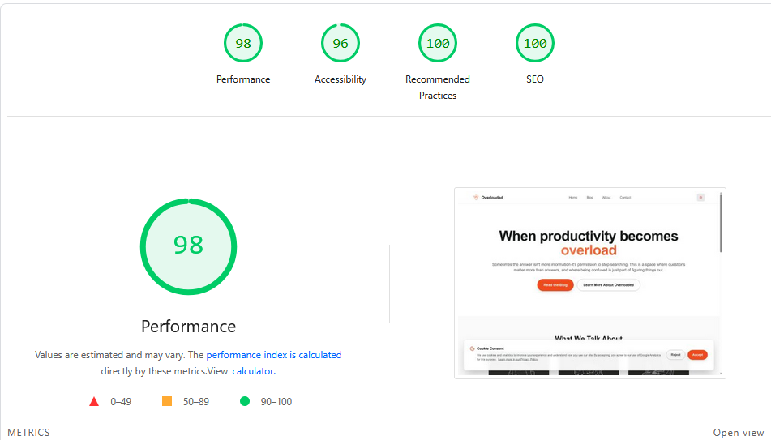

# ⚡ Overloaded

A modern blog focused on discussing burnout, mental health, and the challenges facing society today. Built with cutting-edge web technologies for a smooth, fast, and beautiful user experience.

🌐 **Live:** [overloaded.live](https://www.overloaded.live)

## 📊 Performance

| Metric | Score |
|--------|-------|
| **Performance** | 98 |
| **Accessibility** | 96 |
| **Best Practices** | 100 |
| **SEO** | 100 |

## 🎯 About

Overloaded is a platform dedicated to honest, critical conversations about:
- 🔥 **Burnout Recognition & Recovery**
- 🧠 **Mental Health Awareness**
- 🌍 **Societal Challenges**

The blog takes a cold, clinical approach to modern problems — no sugar-coating, just data-backed analysis.

This project also serves as a **learning playground** to experiment with multiple JavaScript frameworks (Vue, Svelte) working together within Astro's island architecture.

## 🚀 Tech Stack

| Technology | Purpose |
|------------|---------|
| **[Astro](https://astro.build)** | Static site generation with partial hydration |
| **[Vue 3](https://vuejs.org/)** | Interactive components (Header, BackToTop, CookieConsent) |
| **[Svelte](https://svelte.dev/)** | Lightweight components (Footer) |
| **[Tailwind CSS 4](https://tailwindcss.com/)** | Utility-first styling |
| **[MDX](https://mdxjs.com/)** | Blog posts with component support |
| **[TypeScript](https://www.typescriptlang.org/)** | Type safety |
| **[Vercel](https://vercel.com/)** | Hosting & deployment |

## ✨ Features

### Core
- ✅ Static site generation (fast page loads)
- ✅ Partial hydration (minimal JavaScript)
- ✅ Dark/Light theme toggle
- ✅ Fully responsive design
- ✅ Blog with category filtering

### Performance
- ✅ Optimized images (WebP thumbnails)
- ✅ Self-hosted fonts (Inter)
- ✅ Lazy-loaded components
- ✅ Delayed ad loading

### SEO
- ✅ Automatic sitemap generation
- ✅ Structured data (JSON-LD)
- ✅ Open Graph & Twitter Cards
- ✅ Canonical URLs
- ✅ Custom 404 page

### Compliance
- ✅ Cookie consent with Google Consent Mode
- ✅ Privacy Policy & Terms of Service
- ✅ GDPR-ready

## 📄 License

This project is open source and available under the MIT License.

---

Built with ☕ and ❤️ by [IgorJFS](https://github.com/IgorJFS)
